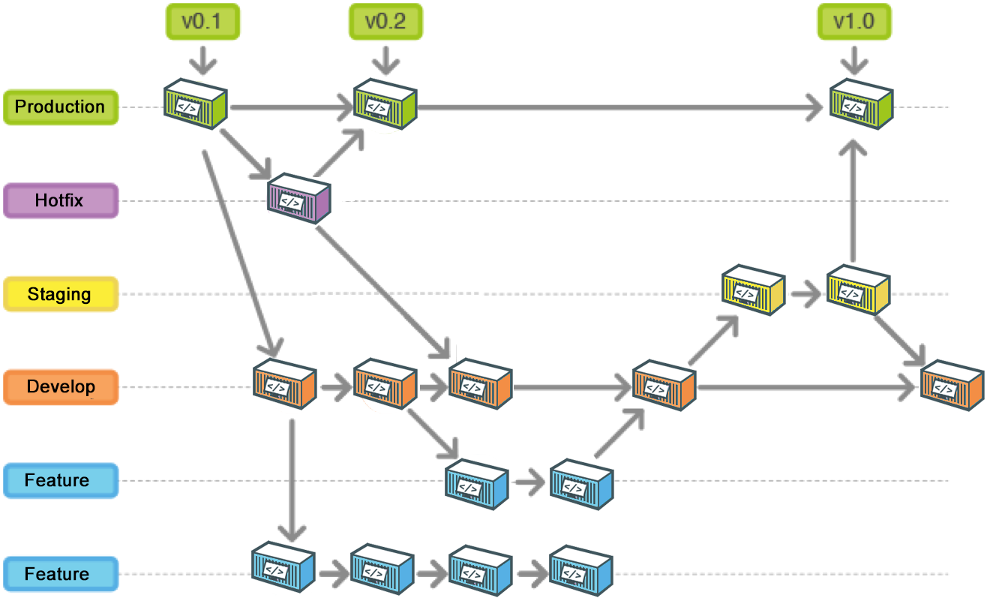

import { Appear } from "@mdx-deck/components";
import { big } from "@mdx-deck/themes";
import theme from "./theme";
import GitHubLogo from "./images/github.svg";
import kevin from "./images/kevin.jpg";
import Link from "./components/Link";
import List from "./components/List";
import Img from "./components/Img";

export const themes = [big, theme];

# Open Source

---

import { Head } from "mdx-deck";
import StallmanQuote from "./components/StallmanQuote";

<Head>
  <link
    href="https://fonts.googleapis.com/css?family=Chelsea+Market&display=swap"
    rel="stylesheet"
  />
</Head>
<StallmanQuote />

---

### Kevin Brewer

### Full-stack Software Engineer

### @ Walmart Labs

#### <Link style={{ fontFamily: 'inherit' }} to="applejax.github.io" />

---

# GitHub Workflow

<ul>
  <Appear>
    <li>
      Fork a project 
    </li>
    <li>
      Clone your Fork 
    </li>
    <li>
      Create a Branch 
    </li>
    <li>
      Git Add / Commit 
    </li>
    <li>
      Push to your Fork 
    </li>
    <li>
      Open a Pull Request 
    </li>
  </Appear>
</ul>

---

---

# Git Branching Workflow

---

# Famous OS Projects

<ul>
  <Appear>
    <li>VS Code</li>
    <li>TensorFlow</li>
    <li>React.js</li>
    <li>Ruby On Rails</li>
    

      

        😍
      

      Great for learning / research
    

    

      

        😔
      

      Not great for first contributions
    

  </Appear>
</ul>

---

### Smaller,

### local projects

### are better for getting started

---

# First Projects

<List>
  <Link to="github.com/trekhleb/javascript-algorithms" />
  <Link to="www.agileventures.org" />
  <Link to="github.com/san-diego-tech-hub" />
  <Link to="github.com/opensandiego" />
  <Link to="github.com/sandiegojs" />
</List>

---

# Coming up to Speed 
🏎💨

<List>
  <Link to="egghead.io/courses/how-to-contribute-to-an-open-source-project-on-github" />
  <Link to="learngitbranching.js.org/?locale=en_US" />
  <Link to="code.energy/open-source-contributing" />
  <Link to="github.github.com/training-kit/downloads/github-git-cheat-sheet" />
  <Link to="lab.github.com" />
</List>

---

# 😎 Thanks!

<Link to="github.com/applejax/open-source-presentation" />
